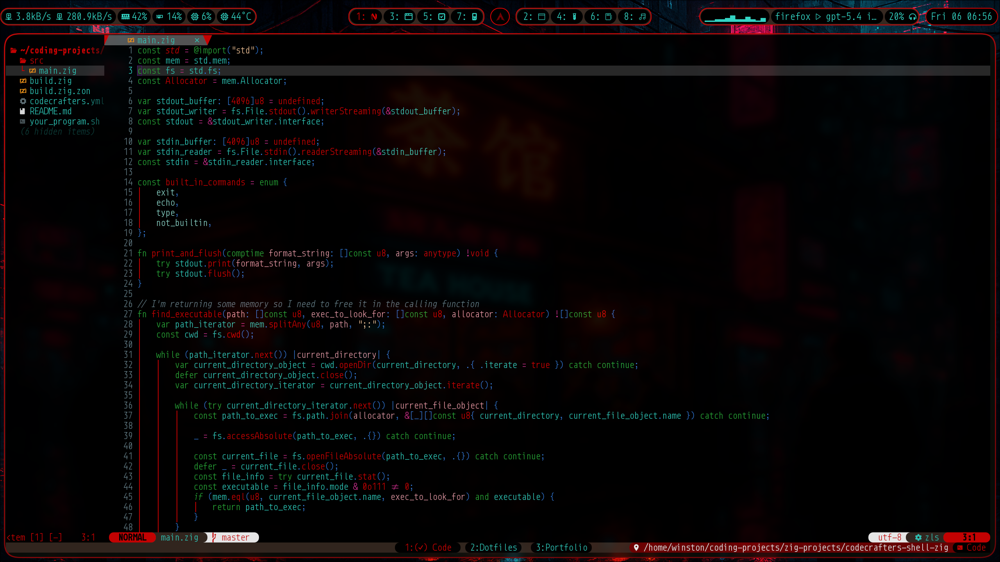
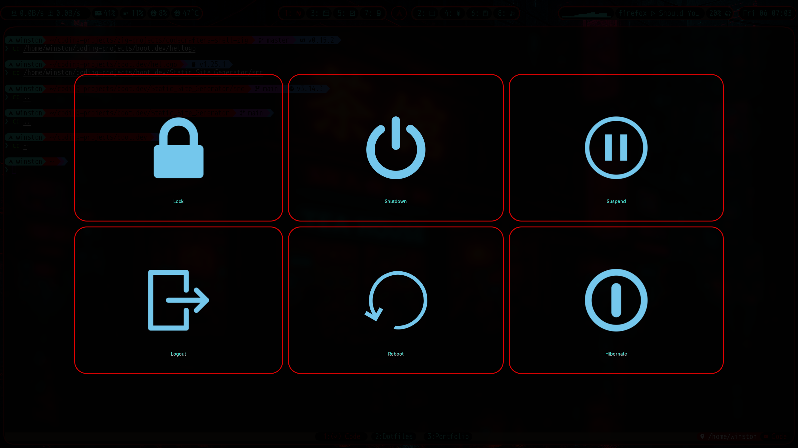
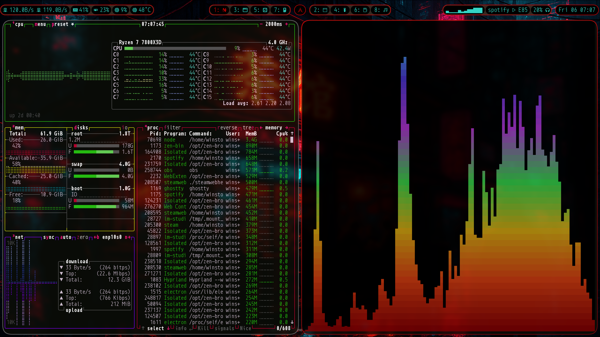
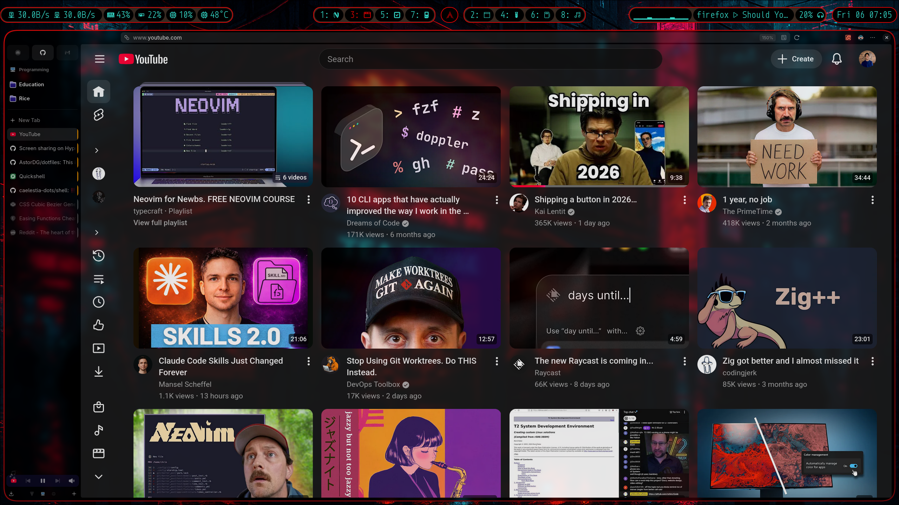

# Intro to Ricing

## Quick Start

If you just want to use these dotfiles without reading the tutorial:

```bash
cd ~
git clone https://github.com/Astordg/dotfile.git
cd dotfiles
stow .
```

Then log out and select Hyprland from your display manager. You'll need the packages listed in [Part 6](<README#Part 5: Setting Up Each Tool>).

For the full guide, read on.


---
<video><src="showoff_assets/showoff.mp4" controls width="100%"></video>

<details>
<summary>📸 Click to view all screenshots</summary>

### Waybar + Wallpaper


### Neovim + Tmux


### Rofi


### Wlogout


### Btop + Cava


### Zen Browser


</details>


---

## Part 1: Before You Start

### Common Traps and Disclaimers

**The `$` prefix**

When guides show terminal commands, they often put `$` at the beginning:

Ex:
```bash
$ sudo pacman -S hyprland
```

The `$` is just a stand-in for your command prompt. Don't type it. Only type or copy the part after:

```bash
sudo pacman -S hyprland
```

**Multi-line commands**

Because of the way markdown renders bash on the web there's a little button to copy commands in the top right corner of bash formatted text sometimes. Such as in the quickstart section of this guide.

Don't copy and paste commands using this button or copy all commands at once. They may not work correctly and leave your terminal in a weird state. Copy and run commands one line at a time remembering to exclude the ```$```.

**Running commands you don't understand**

If you're unsure what a command does, ask Mr. GPT or your favorite Ai assistant to explain it. This is especially helpful for long commands or commands that chain together. 

You can also look up the command in google and see if there's any red flags or helpful explanations that come up.

**[Nerd Fonts](https://www.nerdfonts.com/)**

When you're looking at other people's dotfiles on github you will see little boxes with numbers in them. These are nerdfont icons. You will need to have a nerdfont installed on your system to view these on your system. Github doesn't render them correctly that's why they look like boxes.

**Getting frustrated**

Most of this setup is aesthetic. If customizing a tool is taking too long or frustrating you, remember: you can skip it, use the tool with default settings, find an alternative, or just take a break. The beauty of Linux is choice. If it stops being fun, remember why you started ricing.

### Prerequisites

A distribution of Linux or distro as we call it in the Linux world.

**Distribution recommendations:**
- Arch-based (Arch, EndeavourOS, Manjaro) - Incredibly minimal and doesn't come with any packages preinstalled. Good Hyprland support
- Fedora - Good documentation and good defaults. Linus Torvalds uses this distro. Just sayin.
- Mint, Zorin OS, Pop!_Os, Bazzite - Very beginner friendly.
- Ubuntu/Debian - Old and reliable. Works but may need more manual setup

**Required:**
- Git installed
- A text editor (nano, vim, or any GUI editor such as vscode or gedit)

**Time expectation:** Setting up my full rice took me about a week. This can very a lot though based on how your setting up your system. Starting from scratch will take a lot longer than using someone else's setup and making some tweaks.

## Part 2: Linux Fundamentals

### The Terminal

The terminal is very powerful and is often a core part of using Linux. However it's not as scary as it seems. Don't be afraid!

There are many good GUI tools on linux now. You should know that many GUI tools run terminal commands under the hood so it is good to be familiar with them. This is also true of many of the tools in this rice. Many of these tools have ways to run terminal commands and then display the output.


> [!Note]
> GUI stands for Graphical user interface. It just means a graphical program not a text based one.


Basic commands you'll use:
- `cd foldername` - change directory (navigate to a folder)
- `ls` - list files in current directory
- `ls -a` - list all files including hidden ones
- `cat filename` - display file contents

>[!Tip]
> Install and use lsd instead of ls. It displays icons next to file names that indicate what type of file they are as well as coloring them. Helps a lot for reading terminal output.

**Basic Command Structure**

A typical command is made up of two parts. Program to run then arguments or parameters to that program(optional).

Breaking down the first command example:
1. ```cd``` is the program that is being run.
2. *foldername* is the argument to the program being run. Arguments are given to the program to change its behavior. Most programs can take multiple arguments to do more complex behavior.

The *sudo* prefix is optional and for most commands you won't need it. But there are some commands that require sudo to be allowed to run. Such as installing packages.

Ex:
```bash
$ sudo pacman -S hyprland
```

**Terminal Location**

When you run terminal commands you run them from your current folder. Think of each folder as a location. To access files or run programs in a folder you must be in that folder's location. ```cd``` is the main command for moving around folders. When I say later on that you need to run a command from a location this is what I mean.

### Package Managers

A package is just an application or program. Package managers are a central way to install and remove software on your computer. This is a different model from MacOS or Windows. Instead of downloading installers from websites and having an app store, you use the package manager to handle all your software.

**Installing packages:**

| Distro | Command |
|--------|---------|
| Ubuntu/Debian | `sudo apt install package-name` |
| Arch-based | `sudo pacman -S package-name` |
| Fedora | `sudo dnf install package-name` |

**Searching for packages to install:**

| Distro | Command |
|--------|---------|
| Ubuntu/Debian | `apt search package-name` |
| Arch-based | `pacman -Ss package-name` |
| Fedora | `dnf search package-name` |

**Searching for packages on your system:**

| Distro | Command |
|--------|---------|
| Ubuntu/Debian | `apt list --installed` |
| Arch-based | `pacman -Q package-name` |
| Fedora | `dnf list installed package-name` |

**Removing packages:**

| Distro | Command |
|--------|---------|
| Ubuntu/Debian | `sudo apt remove package-name` |
| Arch-based | `sudo pacman -R package-name` |
| Fedora | `sudo dnf remove package-name` |

> [!Note]
> You should try and be very familiar with the basic commands of your package manager.

> [!Warning]
> Don't try and download another distro's package manager on your computer. Different package managers store and manage data in different ways that can conflict with each other and break your system.

**Appimages**

Appimages are self-contained programs that work on any distro. You can download them from the developer's website, then make them executable:

```bash
chmod u+x filename.AppImage
```

> [!Note]
> You will have to be in the folder that the Appimage was downloaded from for this command to work. 

If you're using a GUI based file browser you can navigate to the folder where the Appimage is and right click on it. There will be an option in a properties / permissions tab to run the file as an executable. You may have to put in your password to do this.

> [!Tip]
> I just have a folder that holds all my Appimages. After I download one I move it to this folder and then make it executable.

### What are Dotfiles?

Dotfiles are files and folders that start with a `.` (dot), making them hidden by default.

Examples: `.zshrc`, `.config/`, `.git/`


**Why hidden?** Most people don't access these files and modifying them can break a system.
> [!Quote]
> We are the exception
> --- Aoi Todo

As someone ricing your system however, you'll need to access these. I find their hidden nature annoying but you can work around it.

**Viewing hidden files:**
- Terminal: `ls -a`
- File manager: Look for "Show Hidden Files" in settings or press `Ctrl+H`

**Where dotfiles live:**
- `~/.zshrc` or `~/.bashrc` - shell configuration
- `~/.config/` - most application configs go here in subfolders (e.g., `~/.config/hypr/`, `~/.config/waybar/`)
- If they don't go in ~/.config documentation will tell you where the config file or folder should go.

> [!Note]
> Some times documentation will say documentation goes in XDG_CONFIG_HOME. This means ~/.config.
> The ```~/``` folder is the home folder

**Why put dotfiles in a git repo?**
- To sync them across computers
- Quick setup on a new machine
- Version control for your configurations

### The PATH and Executables

**What is the PATH?**

The PATH is a list of folders your terminal searches when you type a command. If a program's folder is on the PATH, you can run it from any folder. That's why when you run ```ls``` or ```cd``` you don't have to be in a specific folder.

To view your current PATH from the terminal:
```bash
echo $PATH
```

**Adding folders to your PATH:**

If you download a program manually (not through a package manager), and you want to run it from any folder in the terminal you need to add its folder to the PATH.

For Zsh, add to `~/.zshrc`:
```bash
export PATH=/path/to/program/folder:$PATH
```
Or
```bash
path=(
	$path
	folder_path_1
    folder_path_2
	)
```
> [!Note]
> You can find an example of this style in my .zshrc on line 12

For Bash, add to `~/.bashrc`:
```bash
export PATH=/path/to/program/folder:$PATH
```

> [!Note]
> Add the *folder* containing the executable, not the executable file itself.

**Making files executable:**

Before running downloaded scripts or Appimages, remember to make them executable:
```bash
chmod u+x filename
```

---

## Part 3: Choosing Your Tools

### Desktop Environment vs Tiling Window Manager

**Desktop Environment (DE)** - What you're used to from Windows/Mac:
- Task bar, app launcher, settings panels are included
- Windows float and can be dragged/resized with the mouse
- Works out of the box
- Limited customization

Linux Examples: [GNOME](https://www.gnome.org/?ref=itsfoss.com), [KDE Plasma](https://kde.org/), [Cinnamon](https://projects.linuxmint.com/cinnamon/)

**Tiling Window Manager (TWM)** - Keyboard-focused, Minimal functionality:
- Windows automatically arranged in a grid (non-overlapping)
- No built-in bar, launcher, or settings - you choose each component
- More setup work, and more fine-grained control
- Highly customizable

Examples: [Hyprland](https://hypr.land/), [Niri](https://github.com/niri-wm/niri?tab=readme-ov-file), [i3](https://i3wm.org/)

**How to choose:**
- If you want something that works immediately with decent customization. Use a DE
- If you want maximum aesthetic and functional control and don't mind setup time. Use a TWM
- To choose between DEs or TWMs look at examples of people's setups on [r/unixporn](https://www.reddit.com/r/unixporn/) and on youtube. They often explain the differences and what they like about their particular choice.

>[!Note]
> Some distros allow you to easily have a TWM and a DE. I started on linux mint and installed i3. I could log into i3 and and their DE cinnamon. This allows you to start with a DE and then test out a TWM on the side if you're curious but not ready to jump in.

**How I chose:**
- I chose a tiling window manager because I really liked the aesthetics, tiling window setup, virtual desktops and keyboard focus.
- I spcifically chose Hyprland for my TWM because it looks nice and is popular. There are a lot of guides, example configs and a great wiki.

### The TWM Tool Stack

For a tiling window manager setup, you need multiple tools working together.

This is a diagram of my setup:

```
Tiling Window Manager (Hyprland)
    |
    |-- Bar (Waybar) ---------------- System info, workspaces, clock
    |
    |-- Launcher (Rofi) ------------- Open apps, run commands
    |
    |-- Lock Screen (Hyprlock) ------- Screen lock
    |
    |-- Wallpaper (Hyprpaper) ------- Background images
    |
    |-- Logout Menu (Wlogout) ------- Shutdown, reboot, logout
    |
    |-- Terminal (Ghostty) ---------- Where I run commands and program
            |
            |-- Shell (Zsh) --------- Command interpreter
            |       |
            |       |-- Prompt (Starship) --- Styled command prompt
            |
            |-- Multiplexer (Tmux) -- Optional: Save terminal sessions
```

### Tool Selection Guide

**Window Manager:**
- [Hyprland](https://wiki.hypr.land/) - Modern, great animations, active development, popular (what I use)
- [Niri](https://github.com/niri-wm/niri) - Scroll-based tiling, simpler config
- [Sway](https://github.com/swaywm/sway) - i3-compatible for Wayland, stable
- [i3](https://i3wm.org/) - an x11 compatiable window manager.
- Here's an article that goes more in depth about TWMs: [TWM Article](https://itsfoss.gitlab.io/post/15-best-tiling-window-managers-for-linux-in-2025/). It's suggestions are a bit outdated but they're still valuable.

> [!Note]
> I would recommend looking at some videos of people using these window managers to see what features they have to decide what you like and value for your workflow or aethetics.

**Wallpaper engine + Lockscreen:**
- These choices will mostly come from which window manager you use. Hyprland has an ecosystem so I use the hyprland wallpaper and locksreen engine.
- Most other TWMS don't have an eco system so you choose. You may be able to use hyprpaper if the Window manager is wlroots-based or some other wallpaper engines such as [waypaper](https://github.com/anufrievroman/waypaper).

> [!important]
> Linux has two display protocols. X11 and Wayland. Some distros come with a display protocol. Such as i3 with linux mint for example. So you need to pick a TWM that uses that display protocol.

**Bar:**
- [Waybar](https://github.com/Alexays/Waybar) - Highly customizable, good docs, Wayland based. (What I use)
- [Polybar](https://github.com/polybar/polybar) - More modules, X11 based.

**Launcher:**
- [Rofi](https://github.com/davatorium/rofi) - Flexible, has more than just app launcher capabilities. I have a calculator built in. (what I use)
- [Wofi](https://hg.sr.ht/~scoopta/wofi) - Simpler, GTK-based

**Terminal:**
- [Ghostty](https://ghostty.org/) - Fast, modern features (what I use)
- [Alacritty](https://github.com/alacritty/alacritty) - GPU-accelerated, popular
- [Kitty](https://github.com/kovidgoyal/kitty) - Feature-rich, image support

**Shell:**
- [Zsh](https://www.zsh.org/) - Good plugin ecosystem, similar to Bash. (what I use)
- [Bash](https://www.gnu.org/software/bash/) - Default on most systems.
- [Fish](https://fishshell.com/) - User-friendly, great autosuggestions, needs more setup and is more to learn if you're coming from Bash or Zsh.

> [!Important]
> This is not an exaustive list of options and if you want more options I encourage you to research more.

>[!Note]
> - [Quickshell](https://quickshell.org/) is an all in one tool that can implement a bar, launcher, lockscreen, wallpaper and custom widets. The setup for this is way more complicated than the other tools I mentioned so this is more for programmers or people who want to tinker a lot and have more power and customization.
> - [eww](https://github.com/elkowar/eww/tree/master) is also a more powerful feature rich tool for making widgets and bars. It's also more complex.

---

## Part 4: CSS Basics for Ricing

Several tools use CSS for styling: Waybar, Wlogout, and others. If you haven't used CSS, here's a basic rundown.

### Selectors

CSS selectors target elements to style them:

```css
* { }                    /* Universal - applies to everything */
window { }               /* Element - targets <window> tags */
#workspaces { }          /* ID - targets element with id="workspaces" */
.button { }              /* Class - targets elements with class="button" */
button:hover { }         /* Pseudo-class - targets button on hover */
```

### The Box Model

Every element is a box with layers:

```
+---------------------------------+  <- margin (space outside)
|  +---------------------------+  |
|  |        border             |  |  <- border (edge)
|  |  +---------------------+  |  |
|  |  |     padding         |  |  |  <- padding (space inside)
|  |  |  +---------------+  |  |  |
|  |  |  |   content     |  |  |  |
|  |  |  +---------------+  |  |  |
|  |  +---------------------+  |  |
|  +---------------------------+  |
+---------------------------------+
```

Common properties:
```css
margin: 10px;              /* Space outside the border */
padding: 5px 10px;         /* Space inside the border (vertical horizontal) */
border: 2px solid #D90202; /* Width, style, color */
border-radius: 20px;       /* Rounded corner styling */
```

### Colors

Two common formats:

```css
color: #D90202;                    /* Hex - 6 characters for RGB */
background: rgba(217, 2, 1, 0.5);   /* RGBA - red, green, blue, alpha (transparency) */
```

[htmlcolorcodes.com](https://htmlcolorcodes.com/color-picker/) is a great resource to pick colors.

### Example from My Waybar

```css
#workspaces {
    color: #33d4c4;              /* Text color - cyan */
    margin: 10px 10px;           /* Space around the workspaces block */
    border-radius: 20px;         /* Rounded corners */
    border: 2px solid #D90202;   /* Red border */
    background-color: #362921;   /* Rust orange background */
}

#workspaces button {
    margin: 2px 2px;             /* Space between workspace buttons */
    padding: 2px 15px;           /* Space inside each button */
    background-color: #000000;   /* Black button background */
    border-radius: 40px;         /* Fully rounded buttons */
}

#workspaces button.active {
    color: #D90202;              /* Active workspace text is red */
}
```


> [!Note]
> CSS was tricky for me to figure out. I got the hang of it by making a small change, reloading and seeing the effect.
> I would suggest doing the CSS for the simpler tools first to get a hang of the flow. Reload often so changes effect the look of what you're customizing.

---

## Part 5: Setting Up Each Tool

> [!Note]
> I try my hardest in config files to make them only one or two files if necessary. This makes them more readable for me and I believe for others. Most people don't do this. So if you're looking at other people's dotfiles and jumping around files try and look for common names to see how they style that one element.

> [!Warning] Defaults
> Documentation often doesn't list all configurable options, which is frustration when you want to see all the customization options. I recommend using [Deepwiki](https://deepwiki.com) to query tools for their complete configuration options. You can't rely on people's dotifiles since most don't include default values.

### Zsh

**What it does:** Your shell - interprets commands you type in the terminal.

**Install:**
```bash
sudo apt install zsh      # Ubuntu/Debian
sudo pacman -S zsh        # Arch
sudo dnf install zsh      # Fedora
```

**Config location:** `~/.zshrc`

**Key concepts:**
- Zsh has better autocomplete and syntax highlighting than Bash
- Plugins add functionality (syntax highlighting, autosuggestions)
- Set Zsh as default: `chsh -s $(which zsh)` Most terminals default to bash so you have to do this manually

**My config highlights:**
- PATH configuration on lines 12-15.
```path=($path ~/.zig/)```
- This is the best way to add folders to your path I found. Make sure each folder is on a new line.
- Plugin configuration for syntax highlighting and autosuggestions
- You need to install plugins using your package manager and then point to them in the ~/.zshrc.
- Command history on lines 20-25. This holds my command history which can be useful when I can't remember exact commands.
- In mine you'll see I have them in /opt/homebrew/share/ . This is because I share my .zshrc between my desktop and my mac laptop and this is where homebrew installs these plugins.
- I made these folders on my linux system and then symlinked them to their actual locations. I explain more about symlinks in the Installation section which talks about gnu stow.

**Docs:** [Zsh Wiki](https://www.zsh.org/)

---

### Starship

**What it does:** Makes your command prompt look good and show useful info (git status, current directory, programing language and version).

**Install:**
```bash
sudo apt install starship      # Ubuntu/Debian
sudo pacman -S starship        # Arch
sudo dnf install starship      # Fedora
```

**Config location:** `~/.config/starship.toml`

**Key concepts:**
- The `format` section defines the order of elements
- Each module (directory, git_branch, etc.) can be configured separately.
- You can find a list of built in modules in the configuration section of the wiki.
- Colors are defined per-section
- Under the format section you cusomize each module. Where the name is surrounded by []. Ex: ```[os]```
- Then the options for that module are placed directly under the module name.

**My config highlights:**
- Based on Catppuccin theme provided in the starship examples.
- Custom color scheme matching my rice
- Init starship in your shell file. I have ```eval "$(starship init zsh)"``` as the first line of my .zshrc

**Docs:** [Starship Wiki](https://starship.rs/)

---

### Hyprland

**What it does:** The window manager - handles window placement, workspaces, animations, keybinds, and monitors.

**Install:**
```bash
sudo pacman -S hyprland        # Arch
sudo dnf install hyprland      # Fedora
```

**Config location:** `~/.config/hypr/hyprland.conf`

**Key concepts:**
- Configuration is grouped by categories: `category { variables }`
- Keybinds follow the pattern: `bind = modifier, key, action`
- Workspaces are virtual desktops you switch between that hold windows

**My config highlights:**
- My config is pretty well commented so it should be farily straightforword to reason about.
- Keybinds for launching apps and managing windows
- There are some programs you want to launch at start up like your wallpaper engine and bar. I have this set up on lines 27-32. The arguments to exec-once are the same commands you would put in the terminal.
- The wiki has a list of all of the variables you can modify for each category.
- Hyprland automaticlly reloads on save so you can see your changes right away.

**Docs:** [Hyprland Wiki](https://wiki.hypr.land/)

---

### Waybar

**What it does:** The status bar - shows workspaces, system info, clock, media controls.

**Install:**
```bash
sudo apt install waybar        # Ubuntu/Debian
sudo pacman -S waybar          # Arch
sudo dnf install waybar        # Fedora
```

**Config location:** `~/.config/waybar/`
- `config.jsonc` - functionality (what modules, where they appear)
- `style.css` - appearance (colors, spacing, fonts)

**Key concepts:**
- Modules are defined in config.jsonc with their position (left, center, right)
- A list of built in modules can be found on the wiki
- Custom modules are named as custom/modulename
- Custom modules can run scripts, or terminal commands, with the ```exec": ``` field (see my GPU usage module)
- To create a button use the ```"on-click":``` field in a custom module. These take terminal commands as arguments (see my custom/power module).
- You can group modules together with the ```group``` tag. This is useful to group modules together for CSS styling. There's examples at the bottom of my config.jsonc
- Styling uses CSS selectors based on module names
- When styling custom modules with css they're named as ```custom-yourCustomName``` There's a - instead of a / like there is in the config.jsonc.

**My config highlights:**
- Custom GPU usage and cava module that run scripts
- Grouped modules (hardware, media) for consistent styling
- Color scheme in style.css matching my rice

**Docs:** [Waybar Wiki](https://github.com/Alexays/Waybar/wiki)

---

### Rofi

**What it does:** Application launcher - opens apps, runs commands, can act as a calculator.

**Install:**
```bash
sudo apt install rofi          # Ubuntu/Debian
sudo pacman -S rofi            # Arch
sudo dnf install rofi          # Fedora
```

**Config location:** `~/.config/rofi/`

**Key concepts:**
- Can be invoked in different modes: drun (apps), run (commands), calc (calculator)
- Theme control appearance
- It uses CSS formatting to change the appearence of elements but this doesn't have to be in a seperate file. It can go in the config.rasi.

**My config highlights:**
- Custom theme matching my color palette
- Configured as calculator and Appimage launcher
- Launch from Hyprland with a keybind

> [!Note] Big note
> - This one was a bit tricky to configure as it has some quirks and the wiki is quite confusing for a beginner.
> - The CSS elements you see me customize aren't on the wiki. You can run ```man rofi-theme``` then search for layout elements by typing / (to enter search mode) and then layout.
> - This will show a diagram of the layout with the names of different elements. These are what's being CSS styled.
> - Keybinds are put in the configuration {} section.
> - They start with ```kb-``` You can get a list of these by running rofi -h. This is hard to read but the list of keybinds is at the bottom so scroll up and you should be able to read them.

**Docs:** [Rofi GitHub](https://github.com/davatorium/rofi)

---

### Ghostty

**What it does:** Terminal emulator - where you run commands.

**Install:** See [Ghostty Docs](https://ghostty.org/) for installation methods

**Config location:** `~/.config/ghostty/config`

**Key concepts:**
- Simple key-value configuration format
- Themes change text colors for commands
- Font settings for readability

**My config highlights:**
- Kibble theme matching my rice colors
- Custom keybinds

> [!Note]
> - Cursor animations work in Ghostty by using a GLSL shader. GLSL shaders are bascially a whole programming language so if you like mine I would just suggest sticking to it or just playing around with the colors.
> - [Example shaders](https://github.com/sahaj-b/ghostty-cursor-shaders)
> - [Helpful setup vid](https://www.youtube.com/watch?v=enwDjM7pNNE)
> - Or if you want something super novel you could ask Mr. GPT or your favorite AI helper to make you one. I haven't tried this so I'm not sure how well this will come out.

> [!Note] Note 2
> The docs are really good at listing out config options and explaing formatting. Consult them.

**Docs:** [Ghostty Documentation](https://ghostty.org/)

---

### Hyprlock

**What it does:** Lock screen - secures your system when you step away.

**Install:**
```bash
sudo pacman -S hyprlock        # Arch
sudo dnf install hyprlock      # Fedora
```


**Config location:** `~/.config/hypr/hyprlock.conf`

**Key concepts:**
- Uses same category-based config style as Hyprland
- Can display time, date, user image, input field

**My config highlights:**
- Minimal design with just time and date
- Colors matching my rice

**Docs:** [Hyprlock Wiki](https://wiki.hypr.land/Hypr-Ecosystem/hyprlock/)

---

### Hyprpaper

**What it does:** Wallpaper manager - sets backgrounds for your monitors.

**Install:**
```bash
sudo pacman -S hyprpaper       # Arch
sudo dnf install hyprpaper     # Fedora
```

**Config location:** `~/.config/hypr/hyprpaper.conf`

**Key concepts:**
- Preload wallpapers before using them
- Can set different wallpapers per monitor
- The same monitor naming scheme as hyprland

**My config highlights:**
- Same wallpaper on both monitors
- Wallpapers stored in my wallpapers folder

**Docs:** [Hyprpaper Wiki](https://wiki.hypr.land/Hypr-Ecosystem/hyprpaper/)

---

### Wlogout

**What it does:** Logout menu - buttons for shutdown, reboot, suspend, etc.

**Install:**
```bash
sudo apt install wlogout       # Ubuntu/Debian
sudo pacman -S wlogout         # Arch
sudo dnf install wlogout       # Fedora
```

**Config location:** `~/.config/wlogout/`
- `layout` - button order and labels
- `style.css` - appearance and icons

**Key concepts:**
- Each button runs a command (systemctl poweroff, etc.)
- Icons are set via CSS background-image

**My config highlights:**
- Custom icons for each action
- Colors matching my rice
- Added a sleep command before running suspend because running hyprlock and suspend at the same time caused a problem where it couldn't finish running hyprlock but then couldn't wake up.

**Docs:** [Wlogout GitHub](https://github.com/ArtsyMacaw/wlogout)

---

### Neovim

**What it does:** Text editor - for code, config files, notes.

**Install:**
```bash
sudo apt install neovim        # Ubuntu/Debian
sudo pacman -S neovim          # Arch
sudo dnf install neovim        # Fedora
```

**Config location:** `~/.config/nvim/`

**Key concepts:**
- Neovim requires significant setup to be a full IDE
- Plugins add functionality (LSP, completion, colorschemes)
- Lua is the configuration language

**My config highlights:**
- Catppuccin colorscheme with custom color overrides
- LSP setup for code completion
- See my nvim/README.md for more details

**Recommended starting point:** 
- [kickstart.nvim](https://github.com/nvim-lua/kickstart.nvim) - excellent tutorial and base config by a Neovim maintainer
- Another great starter resource. [Typecraft tutorial](https://www.youtube.com/watch?v=zHTeCSVAFNY&list=PLsz00TDipIffreIaUNk64KxTIkQaGguqn).

**Docs:** [Neovim](https://neovim.io/)

---

### Tmux

**What it does:** Terminal multiplexer - save terminal sessions, split panes, organize projects.

**Install:**
```bash
sudo apt install tmux          # Ubuntu/Debian
sudo pacman -S tmux            # Arch
sudo dnf install tmux          # Fedora
```

**Config location:** `~/.config/tmux/tmux.conf`

**Key concepts:**
- Sessions are saved terminal states
- Windows are tabs within a session
- Panes are splits within a window

**My config highlights:**
- [Tmux Resurrect plugin](https://github.com/tmux-plugins/tmux-resurrect) to save/restore sessions after reboot. [Video guide](https://www.youtube.com/watch?v=sMbuGf2g7gc&t=278s)
- My tmux bar looks very similar to the cattpuccin plugin bar but it doesn't use it. I just wrote the bar from scratch using this [Tonybtw](https://www.youtube.com/watch?v=XivdyrFCV4M&t=280s) video.
- Custom keybinds for navigation

> [!Note]
> This is mostly a programmer tool but can be used if you use the terminal a lot or want to have complex terminal states.
> [Good starter tutorial](https://www.youtube.com/playlist?list=PLsz00TDipIfdrJDjpULKY7mQlIFi4HjdR)

**Docs:** [Tmux Wiki](https://github.com/tmux/tmux/wiki) | [Cheat Sheet](https://tmuxcheatsheet.com/)

---

### Cava

**What it does:** Audio visualizer - displays sound as animated bars in the terminal.

**Install:**
```bash
sudo apt install cava          # Ubuntu/Debian
sudo pacman -S cava            # Arch
sudo dnf install cava          # Fedora
```

**Config location:** `~/.config/cava/config`

**Key concepts:**
- Purely aesthetic
- Customize bar width, height, colors, gradient

**My config highlights:**
- Gradient colors for bars
- Integrated into Waybar as a custom module
- The default config files comes very well commented. I tried to leave them all in so my config explains most of the options.

**Docs:** [Cava GitHub](https://github.com/karlstav/cava)

---

## Part 6: Installing These Dotfiles

### Requirements

Install these packages before using these dotfiles:

> Arch based distro:
```bash
sudo pacman -S git stow zsh starship hyprland waybar rofi hyprlock hyprpaper wlogout neovim tmux cava ttf-monoid-nerd ttf-fantasque-sans-mono
```

> Ubuntu/Debian based distro:
```bash
sudo apt install git stow zsh starship hyprland waybar rofi hyprlock hyprpaper wlogout neovim tmux cava ttf-monoid-nerd ttf-fantasque-sans-mono
```

> For Fedora:
```bash
sudo dnf install git stow zsh starship hyprland waybar rofi hyprlock hyprpaper wlogout neovim tmux cava ttf-monoid-nerd ttf-fantasque-sans-mono
```

> [!note] Nerd Fonts
> I used these resources to pick a nerd font and also when I need to copy and paste an icon
> - [compare and contrast nerd fonts](https://www.programmingfonts.org/#oxproto)
> - [Icon cheat sheet](https://www.nerdfonts.com/cheat-sheet)

### Step-by-Step Installation

1. Clone the repository:
```bash
cd ~
git clone https://github.com/Astordg/dotfile.git
cd dotfiles
```

2. Create symlinks with GNU Stow:
```bash
stow .
```

This creates symlinks from the dotfiles repo to where your system expects them. Your configs now exist in two connected places:
- `~/dotfiles/.config/waybar/` <-> `~/.config/waybar/`
- `~/dotfiles/.zshrc` <-> `~/.zshrc`

> [!Note]
> You can edit the files in both places so don't worry about having to only edit them in the ~/dotfiles/ folder.

> [!Warning] New tool
> - Usually when you download a tool from your package manager it will create a default config file if there isn't one already there
> - This means there will be a config in the ~/.config folder not in this dotfiles folder. To fix that and symlink to this repo. Move that file to this folder and run ```stow .```

> [!Tip] Helpful GNU stow resources
> 1. [GNU stow explainer](https://www.youtube.com/watch?v=y6XCebnB9gs&t=317s)
> 2. [GNU stow explainer with examples](https://www.youtube.com/watch?v=NoFiYOqnC4o&t=391s)
> - These resources explain GNU stow and symlinking more in depth so if you need a refresher or want to learn more I would suggest watching them.

3. Log out and select Hyprland from your display manager.

- If you're on Arch or a distro with no built in Gui this means running ```start-hyprland```

### Customizing

**Change colors:**
- Edit colors in `style.css` files (Waybar, Wlogout)
- Update `starship.toml` for prompt colors
- See [Logistics.md](Logistics.md) for my color palette

**Add your wallpaper:**
- Place wallpapers in the `wallpapers/` folder
- Update `hyprpaper.conf` with the new wallpaper filename

**Make it your own:**
- Modify keybinds and behavior in `hyprland.conf`
- Add/remove Waybar modules in `waybar/config.jsonc`
- Change fonts in any config

---

## Part 7: Troubleshooting & Resources

### Common Issues

**"Config changes aren't applying"**
- Some tools need a reload: press your Hyprland reload keybind or restart the tool. I have a keybind for reload my waybar in my hyprland.conf for example.
- Check for syntax errors (missing brackets, typos etc.)
- Verify you're editing the correct file location

**"Fonts look like boxes with numbers"**
- You need a Nerd Font installed
- Set the font in your terminal and bar configs
- See [Nerd Fonts](https://www.nerdfonts.com/)

**"I don't know what's customizable"**
- [Deepwiki](https://deepwiki.com/) is a great resource to ask questions about specific tools and get specific funtionality.
- Browse r/unixporn dotfiles to see how others configured tools
- Read the default config files (usually have helpful comments)

**"Documentation is confusing"**
- Check GitHub issues for the tool - others may have asked the same question
- Look at example configs from r/unixporn
- Ask an AI to explain specific config options

## Conclusion
I hope you enjoyed this guide! If you find anything confusing create an issue on github and I will try and remedy it or answer your question.

### AI disclosure
I'm adding this section to to let you know that I did use AI to help me structure and review this guide. I feel as though it is important to mention when you use AI so I'm adding this here. I personally used GLM-5 with the [opencode](https://opencode.ai/) harness.

### Resources

**Inspiration:**
- [r/unixporn](https://www.reddit.com/r/unixporn/) - Desktop screenshots and dotfiles

**Documentation Help:**
- [Deepwiki](https://deepwiki.com/) - AI-powered documentation search

**Fonts & Icons:**
- [Nerd Fonts](https://www.nerdfonts.com/) - Fonts with programming icons

**Colors:**
- [HTML Color Codes](https://htmlcolorcodes.com/color-picker/) - Pick and convert colors

**My Color Palette:**
- See [Logistics.md](Logistics.md) for all colors used in this rice

---

### Credits

- Tools used in this rice - linked in [Logistics.md](Logistics.md)
- The r/Unixporn subreddit for providing me with inspiriation and refernce dotfiles to look at. 
- Pewdiepie for motivating me to try Arch linux.

